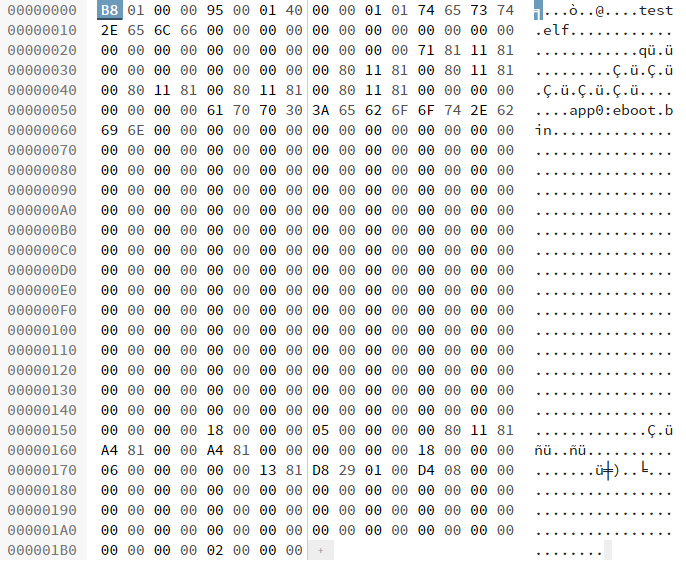

# ebootSegs
PoC for loading as module and dumping loaded vita eboots and stuff...

## Disclaimer:
ihavenoideawhatimdoing.jpg

Mix concept with pfs decryption responsibly, please. :koala:

You will need to massage this to your specific need. Don't expect it to just load stuff from anywhere without a trick or two.

This isn't a magic piracy solution. I'm looking at you anonymous board user!

### Output:
You should get something like:
  
* ebootseg0.bin
  
* ebootseg1.bin
  
* moduleinfo.bin
  
  
For confirmation, moduleinfo.bin will look something like this (this is a brew example only):
  

